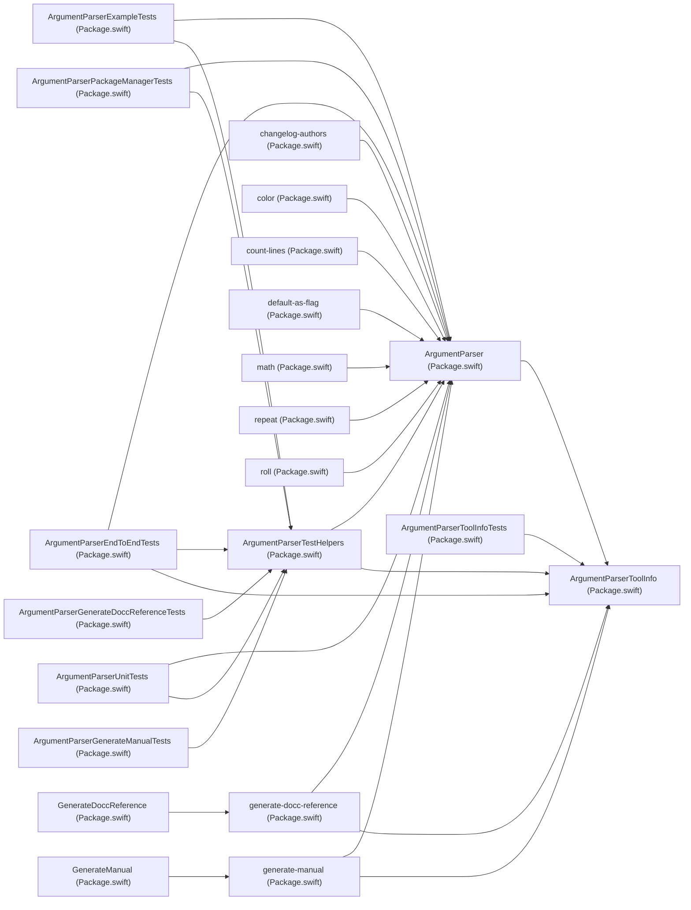

# Module graph

_1 containers, 21 targets, 28 in-tree dependency edges and every Swift import, read from the literal manifest subset and the pinned Swift grammar; no manifest was evaluated and no dependency resolved._

## Containers

| container | container kind |
|---|---|
| `Package.swift` | swift package |

## Targets

| target | container | target kind | conditional | declared at |
|---|---|---|---|---|
| `ArgumentParser` | `Package.swift` | library | — | `Package.swift:31-32` |
| `ArgumentParserTestHelpers` | `Package.swift` | library | — | `Package.swift:35-36` |
| `ArgumentParserToolInfo` | `Package.swift` | library | — | `Package.swift:39-40` |
| `GenerateDoccReference` | `Package.swift` | command plugin | — | `Package.swift:44-45` |
| `GenerateManual` | `Package.swift` | command plugin | — | `Package.swift:56-57` |
| `roll` | `Package.swift` | executable | — | `Package.swift:65-66` |
| `math` | `Package.swift` | executable | — | `Package.swift:69-70` |
| `repeat` | `Package.swift` | executable | — | `Package.swift:73-74` |
| `color` | `Package.swift` | executable | — | `Package.swift:77-78` |
| `default-as-flag` | `Package.swift` | executable | — | `Package.swift:81-82` |
| `generate-docc-reference` | `Package.swift` | executable | — | `Package.swift:88-89` |
| `generate-manual` | `Package.swift` | executable | — | `Package.swift:92-93` |
| `ArgumentParserEndToEndTests` | `Package.swift` | test | — | `Package.swift:98-99` |
| `ArgumentParserExampleTests` | `Package.swift` | test | — | `Package.swift:102-103` |
| `ArgumentParserGenerateDoccReferenceTests` | `Package.swift` | test | — | `Package.swift:107-108` |
| `ArgumentParserGenerateManualTests` | `Package.swift` | test | — | `Package.swift:111-112` |
| `ArgumentParserPackageManagerTests` | `Package.swift` | test | — | `Package.swift:115-116` |
| `ArgumentParserToolInfoTests` | `Package.swift` | test | — | `Package.swift:119-120` |
| `ArgumentParserUnitTests` | `Package.swift` | test | — | `Package.swift:123-124` |
| `count-lines` | `Package.swift` | executable | yes | `Package.swift:133-134` |
| `changelog-authors` | `Package.swift` | executable | yes | `Package.swift:139-140` |

## Graph

## Dependencies

_None._

## Imports

| file | module | import kind | owning target | resolves to |
|---|---|---|---|---|
| `Examples/color/Color.swift:12-12` | `ArgumentParser` | plain | `color (Package.swift)` | `ArgumentParser (Package.swift)` |
| `Examples/count-lines/CountLines.swift:12-12` | `ArgumentParser` | plain | `count-lines (Package.swift)` | `ArgumentParser (Package.swift)` |
| `Examples/count-lines/CountLines.swift:13-13` | `Foundation` | plain | `count-lines (Package.swift)` | sdk-or-unresolved |
| `Examples/default-as-flag/DefaultAsFlag.swift:12-12` | `ArgumentParser` | plain | `default-as-flag (Package.swift)` | `ArgumentParser (Package.swift)` |
| `Examples/math/Math.swift:12-12` | `ArgumentParser` | plain | `math (Package.swift)` | `ArgumentParser (Package.swift)` |
| `Examples/repeat/Repeat.swift:12-12` | `ArgumentParser` | plain | `repeat (Package.swift)` | `ArgumentParser (Package.swift)` |
| `Examples/roll/main.swift:12-12` | `ArgumentParser` | plain | `roll (Package.swift)` | `ArgumentParser (Package.swift)` |
| `Plugins/GenerateCommon/GeneratePlugin.swift:12-12` | `Foundation` | plain | — | sdk-or-unresolved |
| `Plugins/GenerateCommon/GeneratePlugin.swift:13-13` | `PackagePlugin` | plain | — | sdk-or-unresolved |
| `Plugins/GenerateCommon/GeneratePluginError.swift:12-12` | `Foundation` | plain | — | sdk-or-unresolved |
| `Plugins/GenerateCommon/GeneratePluginError.swift:13-13` | `PackagePlugin` | plain | — | sdk-or-unresolved |
| `Plugins/GenerateCommon/PackagePlugin+Helpers.swift:12-12` | `Foundation` | plain | — | sdk-or-unresolved |
| `Plugins/GenerateCommon/PackagePlugin+Helpers.swift:13-13` | `PackagePlugin` | plain | — | sdk-or-unresolved |
| `Plugins/GenerateDoccReference/GenerateDoccReference.swift:12-12` | `Foundation` | plain | `GenerateDoccReference (Package.swift)` | sdk-or-unresolved |
| `Plugins/GenerateDoccReference/GenerateDoccReference.swift:13-13` | `PackagePlugin` | plain | `GenerateDoccReference (Package.swift)` | sdk-or-unresolved |
| `Plugins/GenerateManual/GenerateManualPlugin.swift:12-12` | `Foundation` | plain | `GenerateManual (Package.swift)` | sdk-or-unresolved |
| `Plugins/GenerateManual/GenerateManualPlugin.swift:13-13` | `PackagePlugin` | plain | `GenerateManual (Package.swift)` | sdk-or-unresolved |
| `Sources/ArgumentParser/Completions/BashCompletionsGenerator.swift:12-12` | `ArgumentParserToolInfo` | internal | `ArgumentParser (Package.swift)` | `ArgumentParserToolInfo (Package.swift)` |
| `Sources/ArgumentParser/Completions/CompletionsGenerator.swift:12-12` | `ArgumentParserToolInfo` | internal | `ArgumentParser (Package.swift)` | `ArgumentParserToolInfo (Package.swift)` |
| `Sources/ArgumentParser/Completions/FishCompletionsGenerator.swift:12-12` | `ArgumentParserToolInfo` | internal | `ArgumentParser (Package.swift)` | `ArgumentParserToolInfo (Package.swift)` |
| `Sources/ArgumentParser/Completions/ZshCompletionsGenerator.swift:12-12` | `ArgumentParserToolInfo` | internal | `ArgumentParser (Package.swift)` | `ArgumentParserToolInfo (Package.swift)` |
| `Sources/ArgumentParser/Usage/DumpHelpGenerator.swift:12-12` | `ArgumentParserToolInfo` | internal | `ArgumentParser (Package.swift)` | `ArgumentParserToolInfo (Package.swift)` |
| `Sources/ArgumentParser/Utilities/Foundation.swift:13-13` | `FoundationEssentials` | internal | `ArgumentParser (Package.swift)` | sdk-or-unresolved |
| `Sources/ArgumentParser/Utilities/Foundation.swift:15-15` | `Foundation` | internal | `ArgumentParser (Package.swift)` | sdk-or-unresolved |
| `Sources/ArgumentParser/Utilities/Mutex.swift:13-13` | `os` | internal | `ArgumentParser (Package.swift)` | sdk-or-unresolved |
| `Sources/ArgumentParser/Utilities/Mutex.swift:15-15` | `C` | internal | `ArgumentParser (Package.swift)` | sdk-or-unresolved |
| `Sources/ArgumentParser/Utilities/Mutex.swift:18-18` | `Bionic` | @preconcurrency | `ArgumentParser (Package.swift)` | sdk-or-unresolved |
| `Sources/ArgumentParser/Utilities/Mutex.swift:20-20` | `Glibc` | @preconcurrency | `ArgumentParser (Package.swift)` | sdk-or-unresolved |
| `Sources/ArgumentParser/Utilities/Mutex.swift:22-22` | `Musl` | @preconcurrency | `ArgumentParser (Package.swift)` | sdk-or-unresolved |
| `Sources/ArgumentParser/Utilities/Mutex.swift:24-24` | `WinSDK` | plain | `ArgumentParser (Package.swift)` | sdk-or-unresolved |
| `Sources/ArgumentParser/Utilities/Platform.swift:20-20` | `Glibc` | @preconcurrency | `ArgumentParser (Package.swift)` | sdk-or-unresolved |
| `Sources/ArgumentParser/Utilities/Platform.swift:22-22` | `Musl` | @preconcurrency | `ArgumentParser (Package.swift)` | sdk-or-unresolved |
| `Sources/ArgumentParser/Utilities/Platform.swift:24-24` | `Darwin` | plain | `ArgumentParser (Package.swift)` | sdk-or-unresolved |
| `Sources/ArgumentParser/Utilities/Platform.swift:26-26` | `CRT` | @preconcurrency | `ArgumentParser (Package.swift)` | sdk-or-unresolved |
| `Sources/ArgumentParser/Utilities/Platform.swift:28-28` | `WASILibc` | @preconcurrency | `ArgumentParser (Package.swift)` | sdk-or-unresolved |
| `Sources/ArgumentParser/Utilities/Platform.swift:30-30` | `Android` | @preconcurrency | `ArgumentParser (Package.swift)` | sdk-or-unresolved |
| `Sources/ArgumentParser/Utilities/Platform.swift:136-136` | `WinSDK` | plain | `ArgumentParser (Package.swift)` | sdk-or-unresolved |
| `Sources/ArgumentParser/Utilities/Platform.swift:137-137` | `WinSDK` | plain | `ArgumentParser (Package.swift)` | sdk-or-unresolved |
| `Sources/ArgumentParser/Utilities/Platform.swift:138-138` | `WinSDK` | plain | `ArgumentParser (Package.swift)` | sdk-or-unresolved |
| `Sources/ArgumentParser/Utilities/Platform.swift:139-139` | `WinSDK` | plain | `ArgumentParser (Package.swift)` | sdk-or-unresolved |
| `Sources/ArgumentParser/Utilities/Platform.swift:140-140` | `WinSDK` | plain | `ArgumentParser (Package.swift)` | sdk-or-unresolved |
| `Sources/ArgumentParserTestHelpers/TestHelpers+SwiftTesting+Tags.swift:12-12` | `Testing` | plain | `ArgumentParserTestHelpers (Package.swift)` | sdk-or-unresolved |
| `Sources/ArgumentParserTestHelpers/TestHelpers+SwiftTesting.swift:12-12` | `ArgumentParser` | plain | `ArgumentParserTestHelpers (Package.swift)` | `ArgumentParser (Package.swift)` |
| `Sources/ArgumentParserTestHelpers/TestHelpers+SwiftTesting.swift:13-13` | `ArgumentParserToolInfo` | plain | `ArgumentParserTestHelpers (Package.swift)` | `ArgumentParserToolInfo (Package.swift)` |
| `Sources/ArgumentParserTestHelpers/TestHelpers+SwiftTesting.swift:14-14` | `Foundation` | plain | `ArgumentParserTestHelpers (Package.swift)` | sdk-or-unresolved |
| `Sources/ArgumentParserTestHelpers/TestHelpers+SwiftTesting.swift:15-15` | `Testing` | plain | `ArgumentParserTestHelpers (Package.swift)` | sdk-or-unresolved |
| `Sources/ArgumentParserTestHelpers/TestHelpers.swift:12-12` | `ArgumentParser` | plain | `ArgumentParserTestHelpers (Package.swift)` | `ArgumentParser (Package.swift)` |
| `Sources/ArgumentParserTestHelpers/TestHelpers.swift:13-13` | `ArgumentParserToolInfo` | plain | `ArgumentParserTestHelpers (Package.swift)` | `ArgumentParserToolInfo (Package.swift)` |
| `Sources/ArgumentParserTestHelpers/TestHelpers.swift:14-14` | `XCTest` | plain | `ArgumentParserTestHelpers (Package.swift)` | sdk-or-unresolved |
| `Tests/ArgumentParserEndToEndTests/AsyncCommandEndToEndTests.swift:12-12` | `ArgumentParser` | plain | `ArgumentParserEndToEndTests (Package.swift)` | `ArgumentParser (Package.swift)` |
| `Tests/ArgumentParserEndToEndTests/AsyncCommandEndToEndTests.swift:13-13` | `Testing` | plain | `ArgumentParserEndToEndTests (Package.swift)` | sdk-or-unresolved |
| `Tests/ArgumentParserEndToEndTests/CustomParsingEndToEndTests.swift:12-12` | `ArgumentParser` | plain | `ArgumentParserEndToEndTests (Package.swift)` | `ArgumentParser (Package.swift)` |
| `Tests/ArgumentParserEndToEndTests/CustomParsingEndToEndTests.swift:13-13` | `ArgumentParserTestHelpers` | plain | `ArgumentParserEndToEndTests (Package.swift)` | `ArgumentParserTestHelpers (Package.swift)` |
| `Tests/ArgumentParserEndToEndTests/CustomParsingEndToEndTests.swift:14-14` | `Testing` | plain | `ArgumentParserEndToEndTests (Package.swift)` | sdk-or-unresolved |
| `Tests/ArgumentParserEndToEndTests/DefaultAsFlagEndToEndTests.swift:12-12` | `ArgumentParser` | plain | `ArgumentParserEndToEndTests (Package.swift)` | `ArgumentParser (Package.swift)` |
| `Tests/ArgumentParserEndToEndTests/DefaultAsFlagEndToEndTests.swift:13-13` | `ArgumentParserTestHelpers` | plain | `ArgumentParserEndToEndTests (Package.swift)` | `ArgumentParserTestHelpers (Package.swift)` |
| `Tests/ArgumentParserEndToEndTests/DefaultAsFlagEndToEndTests.swift:14-14` | `Testing` | plain | `ArgumentParserEndToEndTests (Package.swift)` | sdk-or-unresolved |
| `Tests/ArgumentParserEndToEndTests/DefaultSubcommandEndToEndTests.swift:12-12` | `ArgumentParserTestHelpers` | plain | `ArgumentParserEndToEndTests (Package.swift)` | `ArgumentParserTestHelpers (Package.swift)` |
| `Tests/ArgumentParserEndToEndTests/DefaultSubcommandEndToEndTests.swift:13-13` | `ArgumentParserToolInfo` | plain | `ArgumentParserEndToEndTests (Package.swift)` | `ArgumentParserToolInfo (Package.swift)` |
| `Tests/ArgumentParserEndToEndTests/DefaultSubcommandEndToEndTests.swift:14-14` | `Testing` | plain | `ArgumentParserEndToEndTests (Package.swift)` | sdk-or-unresolved |
| `Tests/ArgumentParserEndToEndTests/DefaultSubcommandEndToEndTests.swift:16-16` | `ArgumentParser` | @testable | `ArgumentParserEndToEndTests (Package.swift)` | `ArgumentParser (Package.swift)` |
| `Tests/ArgumentParserEndToEndTests/DefaultsEndToEndTests.swift:12-12` | `ArgumentParser` | plain | `ArgumentParserEndToEndTests (Package.swift)` | `ArgumentParser (Package.swift)` |
| `Tests/ArgumentParserEndToEndTests/DefaultsEndToEndTests.swift:13-13` | `ArgumentParserTestHelpers` | plain | `ArgumentParserEndToEndTests (Package.swift)` | `ArgumentParserTestHelpers (Package.swift)` |
| `Tests/ArgumentParserEndToEndTests/DefaultsEndToEndTests.swift:14-14` | `Testing` | plain | `ArgumentParserEndToEndTests (Package.swift)` | sdk-or-unresolved |
| `Tests/ArgumentParserEndToEndTests/EnumEndToEndTests.swift:12-12` | `ArgumentParser` | plain | `ArgumentParserEndToEndTests (Package.swift)` | `ArgumentParser (Package.swift)` |
| `Tests/ArgumentParserEndToEndTests/EnumEndToEndTests.swift:13-13` | `ArgumentParserTestHelpers` | plain | `ArgumentParserEndToEndTests (Package.swift)` | `ArgumentParserTestHelpers (Package.swift)` |
| `Tests/ArgumentParserEndToEndTests/EnumEndToEndTests.swift:14-14` | `Testing` | plain | `ArgumentParserEndToEndTests (Package.swift)` | sdk-or-unresolved |
| `Tests/ArgumentParserEndToEndTests/EqualsEndToEndTests.swift:12-12` | `ArgumentParser` | plain | `ArgumentParserEndToEndTests (Package.swift)` | `ArgumentParser (Package.swift)` |
| `Tests/ArgumentParserEndToEndTests/EqualsEndToEndTests.swift:13-13` | `ArgumentParserTestHelpers` | plain | `ArgumentParserEndToEndTests (Package.swift)` | `ArgumentParserTestHelpers (Package.swift)` |
| `Tests/ArgumentParserEndToEndTests/EqualsEndToEndTests.swift:14-14` | `Testing` | plain | `ArgumentParserEndToEndTests (Package.swift)` | sdk-or-unresolved |
| `Tests/ArgumentParserEndToEndTests/FlagsEndToEndTests.swift:12-12` | `ArgumentParser` | plain | `ArgumentParserEndToEndTests (Package.swift)` | `ArgumentParser (Package.swift)` |
| `Tests/ArgumentParserEndToEndTests/FlagsEndToEndTests.swift:13-13` | `ArgumentParserTestHelpers` | plain | `ArgumentParserEndToEndTests (Package.swift)` | `ArgumentParserTestHelpers (Package.swift)` |
| `Tests/ArgumentParserEndToEndTests/FlagsEndToEndTests.swift:14-14` | `Testing` | plain | `ArgumentParserEndToEndTests (Package.swift)` | sdk-or-unresolved |
| `Tests/ArgumentParserEndToEndTests/JoinedEndToEndTests.swift:12-12` | `ArgumentParser` | plain | `ArgumentParserEndToEndTests (Package.swift)` | `ArgumentParser (Package.swift)` |
| `Tests/ArgumentParserEndToEndTests/JoinedEndToEndTests.swift:13-13` | `ArgumentParserTestHelpers` | plain | `ArgumentParserEndToEndTests (Package.swift)` | `ArgumentParserTestHelpers (Package.swift)` |
| `Tests/ArgumentParserEndToEndTests/JoinedEndToEndTests.swift:14-14` | `Testing` | plain | `ArgumentParserEndToEndTests (Package.swift)` | sdk-or-unresolved |
| `Tests/ArgumentParserEndToEndTests/LongNameWithShortDashEndToEndTests.swift:12-12` | `ArgumentParser` | plain | `ArgumentParserEndToEndTests (Package.swift)` | `ArgumentParser (Package.swift)` |
| `Tests/ArgumentParserEndToEndTests/LongNameWithShortDashEndToEndTests.swift:13-13` | `ArgumentParserTestHelpers` | plain | `ArgumentParserEndToEndTests (Package.swift)` | `ArgumentParserTestHelpers (Package.swift)` |
| `Tests/ArgumentParserEndToEndTests/LongNameWithShortDashEndToEndTests.swift:14-14` | `Testing` | plain | `ArgumentParserEndToEndTests (Package.swift)` | sdk-or-unresolved |
| `Tests/ArgumentParserEndToEndTests/NestedCommandEndToEndTests.swift:12-12` | `ArgumentParser` | plain | `ArgumentParserEndToEndTests (Package.swift)` | `ArgumentParser (Package.swift)` |
| `Tests/ArgumentParserEndToEndTests/NestedCommandEndToEndTests.swift:13-13` | `ArgumentParserTestHelpers` | plain | `ArgumentParserEndToEndTests (Package.swift)` | `ArgumentParserTestHelpers (Package.swift)` |
| `Tests/ArgumentParserEndToEndTests/NestedCommandEndToEndTests.swift:14-14` | `Testing` | plain | `ArgumentParserEndToEndTests (Package.swift)` | sdk-or-unresolved |
| `Tests/ArgumentParserEndToEndTests/OptionGroupEndToEndTests.swift:12-12` | `ArgumentParser` | plain | `ArgumentParserEndToEndTests (Package.swift)` | `ArgumentParser (Package.swift)` |
| `Tests/ArgumentParserEndToEndTests/OptionGroupEndToEndTests.swift:13-13` | `ArgumentParserTestHelpers` | plain | `ArgumentParserEndToEndTests (Package.swift)` | `ArgumentParserTestHelpers (Package.swift)` |
| `Tests/ArgumentParserEndToEndTests/OptionGroupEndToEndTests.swift:14-14` | `Testing` | plain | `ArgumentParserEndToEndTests (Package.swift)` | sdk-or-unresolved |
| `Tests/ArgumentParserEndToEndTests/OptionalEndToEndTests.swift:12-12` | `ArgumentParser` | plain | `ArgumentParserEndToEndTests (Package.swift)` | `ArgumentParser (Package.swift)` |
| `Tests/ArgumentParserEndToEndTests/OptionalEndToEndTests.swift:13-13` | `ArgumentParserTestHelpers` | plain | `ArgumentParserEndToEndTests (Package.swift)` | `ArgumentParserTestHelpers (Package.swift)` |
| `Tests/ArgumentParserEndToEndTests/OptionalEndToEndTests.swift:14-14` | `Testing` | plain | `ArgumentParserEndToEndTests (Package.swift)` | sdk-or-unresolved |
| `Tests/ArgumentParserEndToEndTests/PositionalEndToEndTests.swift:12-12` | `ArgumentParser` | plain | `ArgumentParserEndToEndTests (Package.swift)` | `ArgumentParser (Package.swift)` |
| `Tests/ArgumentParserEndToEndTests/PositionalEndToEndTests.swift:13-13` | `ArgumentParserTestHelpers` | plain | `ArgumentParserEndToEndTests (Package.swift)` | `ArgumentParserTestHelpers (Package.swift)` |
| `Tests/ArgumentParserEndToEndTests/PositionalEndToEndTests.swift:14-14` | `Testing` | plain | `ArgumentParserEndToEndTests (Package.swift)` | sdk-or-unresolved |
| `Tests/ArgumentParserEndToEndTests/RawRepresentableEndToEndTests.swift:12-12` | `ArgumentParser` | plain | `ArgumentParserEndToEndTests (Package.swift)` | `ArgumentParser (Package.swift)` |
| `Tests/ArgumentParserEndToEndTests/RawRepresentableEndToEndTests.swift:13-13` | `ArgumentParserTestHelpers` | plain | `ArgumentParserEndToEndTests (Package.swift)` | `ArgumentParserTestHelpers (Package.swift)` |
| `Tests/ArgumentParserEndToEndTests/RawRepresentableEndToEndTests.swift:14-14` | `Testing` | plain | `ArgumentParserEndToEndTests (Package.swift)` | sdk-or-unresolved |
| `Tests/ArgumentParserEndToEndTests/RepeatingEndToEndTests+ParsingStrategy.swift:12-12` | `ArgumentParserTestHelpers` | plain | `ArgumentParserEndToEndTests (Package.swift)` | `ArgumentParserTestHelpers (Package.swift)` |
| `Tests/ArgumentParserEndToEndTests/RepeatingEndToEndTests+ParsingStrategy.swift:13-13` | `Testing` | plain | `ArgumentParserEndToEndTests (Package.swift)` | sdk-or-unresolved |
| `Tests/ArgumentParserEndToEndTests/RepeatingEndToEndTests+ParsingStrategy.swift:15-15` | `ArgumentParser` | @testable | `ArgumentParserEndToEndTests (Package.swift)` | `ArgumentParser (Package.swift)` |
| `Tests/ArgumentParserEndToEndTests/RepeatingEndToEndTests.swift:12-12` | `ArgumentParser` | plain | `ArgumentParserEndToEndTests (Package.swift)` | `ArgumentParser (Package.swift)` |
| `Tests/ArgumentParserEndToEndTests/RepeatingEndToEndTests.swift:13-13` | `ArgumentParserTestHelpers` | plain | `ArgumentParserEndToEndTests (Package.swift)` | `ArgumentParserTestHelpers (Package.swift)` |
| `Tests/ArgumentParserEndToEndTests/RepeatingEndToEndTests.swift:14-14` | `Foundation` | plain | `ArgumentParserEndToEndTests (Package.swift)` | sdk-or-unresolved |
| `Tests/ArgumentParserEndToEndTests/RepeatingEndToEndTests.swift:15-15` | `Testing` | plain | `ArgumentParserEndToEndTests (Package.swift)` | sdk-or-unresolved |
| `Tests/ArgumentParserEndToEndTests/ShortNameEndToEndTests.swift:12-12` | `ArgumentParser` | plain | `ArgumentParserEndToEndTests (Package.swift)` | `ArgumentParser (Package.swift)` |
| `Tests/ArgumentParserEndToEndTests/ShortNameEndToEndTests.swift:13-13` | `ArgumentParserTestHelpers` | plain | `ArgumentParserEndToEndTests (Package.swift)` | `ArgumentParserTestHelpers (Package.swift)` |
| `Tests/ArgumentParserEndToEndTests/ShortNameEndToEndTests.swift:14-14` | `Testing` | plain | `ArgumentParserEndToEndTests (Package.swift)` | sdk-or-unresolved |
| `Tests/ArgumentParserEndToEndTests/SimpleEndToEndTests.swift:12-12` | `ArgumentParser` | plain | `ArgumentParserEndToEndTests (Package.swift)` | `ArgumentParser (Package.swift)` |
| `Tests/ArgumentParserEndToEndTests/SimpleEndToEndTests.swift:13-13` | `ArgumentParserTestHelpers` | plain | `ArgumentParserEndToEndTests (Package.swift)` | `ArgumentParserTestHelpers (Package.swift)` |
| `Tests/ArgumentParserEndToEndTests/SimpleEndToEndTests.swift:14-14` | `Testing` | plain | `ArgumentParserEndToEndTests (Package.swift)` | sdk-or-unresolved |
| `Tests/ArgumentParserEndToEndTests/SingleValueParsingStrategyTests.swift:12-12` | `ArgumentParser` | plain | `ArgumentParserEndToEndTests (Package.swift)` | `ArgumentParser (Package.swift)` |
| `Tests/ArgumentParserEndToEndTests/SingleValueParsingStrategyTests.swift:13-13` | `ArgumentParserTestHelpers` | plain | `ArgumentParserEndToEndTests (Package.swift)` | `ArgumentParserTestHelpers (Package.swift)` |
| `Tests/ArgumentParserEndToEndTests/SingleValueParsingStrategyTests.swift:14-14` | `Testing` | plain | `ArgumentParserEndToEndTests (Package.swift)` | sdk-or-unresolved |
| `Tests/ArgumentParserEndToEndTests/SourceCompatEndToEndTests.swift:12-12` | `ArgumentParser` | plain | `ArgumentParserEndToEndTests (Package.swift)` | `ArgumentParser (Package.swift)` |
| `Tests/ArgumentParserEndToEndTests/SourceCompatEndToEndTests.swift:13-13` | `ArgumentParserTestHelpers` | plain | `ArgumentParserEndToEndTests (Package.swift)` | `ArgumentParserTestHelpers (Package.swift)` |
| `Tests/ArgumentParserEndToEndTests/SourceCompatEndToEndTests.swift:14-14` | `Testing` | plain | `ArgumentParserEndToEndTests (Package.swift)` | sdk-or-unresolved |
| `Tests/ArgumentParserEndToEndTests/SubcommandEndToEndTests.swift:12-12` | `ArgumentParser` | plain | `ArgumentParserEndToEndTests (Package.swift)` | `ArgumentParser (Package.swift)` |
| `Tests/ArgumentParserEndToEndTests/SubcommandEndToEndTests.swift:13-13` | `ArgumentParserTestHelpers` | plain | `ArgumentParserEndToEndTests (Package.swift)` | `ArgumentParserTestHelpers (Package.swift)` |
| `Tests/ArgumentParserEndToEndTests/SubcommandEndToEndTests.swift:14-14` | `Testing` | plain | `ArgumentParserEndToEndTests (Package.swift)` | sdk-or-unresolved |
| `Tests/ArgumentParserEndToEndTests/TransformEndToEndTests.swift:12-12` | `ArgumentParser` | plain | `ArgumentParserEndToEndTests (Package.swift)` | `ArgumentParser (Package.swift)` |
| `Tests/ArgumentParserEndToEndTests/TransformEndToEndTests.swift:13-13` | `ArgumentParserTestHelpers` | plain | `ArgumentParserEndToEndTests (Package.swift)` | `ArgumentParserTestHelpers (Package.swift)` |
| `Tests/ArgumentParserEndToEndTests/TransformEndToEndTests.swift:14-14` | `Testing` | plain | `ArgumentParserEndToEndTests (Package.swift)` | sdk-or-unresolved |
| `Tests/ArgumentParserEndToEndTests/UnparsedValuesEndToEndTest.swift:12-12` | `ArgumentParser` | plain | `ArgumentParserEndToEndTests (Package.swift)` | `ArgumentParser (Package.swift)` |
| `Tests/ArgumentParserEndToEndTests/UnparsedValuesEndToEndTest.swift:13-13` | `ArgumentParserTestHelpers` | plain | `ArgumentParserEndToEndTests (Package.swift)` | `ArgumentParserTestHelpers (Package.swift)` |
| `Tests/ArgumentParserEndToEndTests/UnparsedValuesEndToEndTest.swift:14-14` | `Testing` | plain | `ArgumentParserEndToEndTests (Package.swift)` | sdk-or-unresolved |
| `Tests/ArgumentParserEndToEndTests/ValidationEndToEndTests.swift:12-12` | `ArgumentParser` | plain | `ArgumentParserEndToEndTests (Package.swift)` | `ArgumentParser (Package.swift)` |
| `Tests/ArgumentParserEndToEndTests/ValidationEndToEndTests.swift:13-13` | `ArgumentParserTestHelpers` | plain | `ArgumentParserEndToEndTests (Package.swift)` | `ArgumentParserTestHelpers (Package.swift)` |
| `Tests/ArgumentParserEndToEndTests/ValidationEndToEndTests.swift:14-14` | `Foundation` | plain | `ArgumentParserEndToEndTests (Package.swift)` | sdk-or-unresolved |
| `Tests/ArgumentParserEndToEndTests/ValidationEndToEndTests.swift:15-15` | `Testing` | plain | `ArgumentParserEndToEndTests (Package.swift)` | sdk-or-unresolved |
| `Tests/ArgumentParserExampleTests/CountLinesExampleTests.swift:14-14` | `ArgumentParserTestHelpers` | plain | `ArgumentParserExampleTests (Package.swift)` | `ArgumentParserTestHelpers (Package.swift)` |
| `Tests/ArgumentParserExampleTests/CountLinesExampleTests.swift:15-15` | `Foundation` | plain | `ArgumentParserExampleTests (Package.swift)` | sdk-or-unresolved |
| `Tests/ArgumentParserExampleTests/CountLinesExampleTests.swift:16-16` | `Testing` | plain | `ArgumentParserExampleTests (Package.swift)` | sdk-or-unresolved |
| `Tests/ArgumentParserExampleTests/CountLinesExampleTests.swift:18-18` | `ArgumentParser` | @testable | `ArgumentParserExampleTests (Package.swift)` | `ArgumentParser (Package.swift)` |
| `Tests/ArgumentParserExampleTests/MathExampleTests.swift:12-12` | `ArgumentParserTestHelpers` | plain | `ArgumentParserExampleTests (Package.swift)` | `ArgumentParserTestHelpers (Package.swift)` |
| `Tests/ArgumentParserExampleTests/MathExampleTests.swift:13-13` | `Testing` | plain | `ArgumentParserExampleTests (Package.swift)` | sdk-or-unresolved |
| `Tests/ArgumentParserExampleTests/MathExampleTests.swift:15-15` | `ArgumentParser` | @testable | `ArgumentParserExampleTests (Package.swift)` | `ArgumentParser (Package.swift)` |
| `Tests/ArgumentParserExampleTests/RepeatExampleTests.swift:12-12` | `ArgumentParserTestHelpers` | plain | `ArgumentParserExampleTests (Package.swift)` | `ArgumentParserTestHelpers (Package.swift)` |
| `Tests/ArgumentParserExampleTests/RepeatExampleTests.swift:13-13` | `Testing` | plain | `ArgumentParserExampleTests (Package.swift)` | sdk-or-unresolved |
| `Tests/ArgumentParserExampleTests/RepeatExampleTests.swift:15-15` | `ArgumentParser` | @testable | `ArgumentParserExampleTests (Package.swift)` | `ArgumentParser (Package.swift)` |
| `Tests/ArgumentParserExampleTests/RollDiceExampleTests.swift:12-12` | `ArgumentParserTestHelpers` | plain | `ArgumentParserExampleTests (Package.swift)` | `ArgumentParserTestHelpers (Package.swift)` |
| `Tests/ArgumentParserExampleTests/RollDiceExampleTests.swift:13-13` | `Testing` | plain | `ArgumentParserExampleTests (Package.swift)` | sdk-or-unresolved |
| `Tests/ArgumentParserExampleTests/RollDiceExampleTests.swift:15-15` | `ArgumentParser` | @testable | `ArgumentParserExampleTests (Package.swift)` | `ArgumentParser (Package.swift)` |
| `Tests/ArgumentParserGenerateDoccReferenceTests/GenerateDoccReferenceTests.swift:12-12` | `ArgumentParserTestHelpers` | plain | `ArgumentParserGenerateDoccReferenceTests (Package.swift)` | `ArgumentParserTestHelpers (Package.swift)` |
| `Tests/ArgumentParserGenerateDoccReferenceTests/GenerateDoccReferenceTests.swift:13-13` | `Testing` | plain | `ArgumentParserGenerateDoccReferenceTests (Package.swift)` | sdk-or-unresolved |
| `Tests/ArgumentParserGenerateManualTests/GenerateManualTests.swift:12-12` | `ArgumentParserTestHelpers` | plain | `ArgumentParserGenerateManualTests (Package.swift)` | `ArgumentParserTestHelpers (Package.swift)` |
| `Tests/ArgumentParserGenerateManualTests/GenerateManualTests.swift:13-13` | `Testing` | plain | `ArgumentParserGenerateManualTests (Package.swift)` | sdk-or-unresolved |
| `Tests/ArgumentParserPackageManagerTests/HelpTests.swift:12-12` | `ArgumentParserTestHelpers` | plain | `ArgumentParserPackageManagerTests (Package.swift)` | `ArgumentParserTestHelpers (Package.swift)` |
| `Tests/ArgumentParserPackageManagerTests/HelpTests.swift:13-13` | `Testing` | plain | `ArgumentParserPackageManagerTests (Package.swift)` | sdk-or-unresolved |
| `Tests/ArgumentParserPackageManagerTests/HelpTests.swift:15-15` | `ArgumentParser` | @testable | `ArgumentParserPackageManagerTests (Package.swift)` | `ArgumentParser (Package.swift)` |
| `Tests/ArgumentParserPackageManagerTests/PackageManager/Clean.swift:12-12` | `ArgumentParser` | plain | `ArgumentParserPackageManagerTests (Package.swift)` | `ArgumentParser (Package.swift)` |
| `Tests/ArgumentParserPackageManagerTests/PackageManager/Config.swift:12-12` | `ArgumentParser` | plain | `ArgumentParserPackageManagerTests (Package.swift)` | `ArgumentParser (Package.swift)` |
| `Tests/ArgumentParserPackageManagerTests/PackageManager/Describe.swift:12-12` | `ArgumentParser` | plain | `ArgumentParserPackageManagerTests (Package.swift)` | `ArgumentParser (Package.swift)` |
| `Tests/ArgumentParserPackageManagerTests/PackageManager/GenerateXcodeProject.swift:12-12` | `ArgumentParser` | plain | `ArgumentParserPackageManagerTests (Package.swift)` | `ArgumentParser (Package.swift)` |
| `Tests/ArgumentParserPackageManagerTests/PackageManager/Options.swift:12-12` | `ArgumentParser` | plain | `ArgumentParserPackageManagerTests (Package.swift)` | `ArgumentParser (Package.swift)` |
| `Tests/ArgumentParserPackageManagerTests/Tests.swift:12-12` | `ArgumentParserTestHelpers` | plain | `ArgumentParserPackageManagerTests (Package.swift)` | `ArgumentParserTestHelpers (Package.swift)` |
| `Tests/ArgumentParserPackageManagerTests/Tests.swift:13-13` | `Testing` | plain | `ArgumentParserPackageManagerTests (Package.swift)` | sdk-or-unresolved |
| `Tests/ArgumentParserPackageManagerTests/Tests.swift:15-15` | `ArgumentParser` | @testable | `ArgumentParserPackageManagerTests (Package.swift)` | `ArgumentParser (Package.swift)` |
| `Tests/ArgumentParserToolInfoTests/ArgumentParserToolInfoTests.swift:12-12` | `ArgumentParserToolInfo` | plain | `ArgumentParserToolInfoTests (Package.swift)` | `ArgumentParserToolInfo (Package.swift)` |
| `Tests/ArgumentParserToolInfoTests/ArgumentParserToolInfoTests.swift:13-13` | `Foundation` | plain | `ArgumentParserToolInfoTests (Package.swift)` | sdk-or-unresolved |
| `Tests/ArgumentParserToolInfoTests/ArgumentParserToolInfoTests.swift:14-14` | `Testing` | plain | `ArgumentParserToolInfoTests (Package.swift)` | sdk-or-unresolved |
| `Tests/ArgumentParserUnitTests/CompletionScriptTests.swift:12-12` | `ArgumentParserTestHelpers` | plain | `ArgumentParserUnitTests (Package.swift)` | `ArgumentParserTestHelpers (Package.swift)` |
| `Tests/ArgumentParserUnitTests/CompletionScriptTests.swift:13-13` | `Testing` | plain | `ArgumentParserUnitTests (Package.swift)` | sdk-or-unresolved |
| `Tests/ArgumentParserUnitTests/CompletionScriptTests.swift:15-15` | `ArgumentParser` | @testable | `ArgumentParserUnitTests (Package.swift)` | `ArgumentParser (Package.swift)` |
| `Tests/ArgumentParserUnitTests/DefaultAsFlagCompletionTests.swift:12-12` | `ArgumentParserTestHelpers` | plain | `ArgumentParserUnitTests (Package.swift)` | `ArgumentParserTestHelpers (Package.swift)` |
| `Tests/ArgumentParserUnitTests/DefaultAsFlagCompletionTests.swift:13-13` | `Testing` | plain | `ArgumentParserUnitTests (Package.swift)` | sdk-or-unresolved |
| `Tests/ArgumentParserUnitTests/DefaultAsFlagCompletionTests.swift:15-15` | `ArgumentParser` | @testable | `ArgumentParserUnitTests (Package.swift)` | `ArgumentParser (Package.swift)` |
| `Tests/ArgumentParserUnitTests/DefaultAsFlagDumpHelpTests.swift:12-12` | `ArgumentParserTestHelpers` | plain | `ArgumentParserUnitTests (Package.swift)` | `ArgumentParserTestHelpers (Package.swift)` |
| `Tests/ArgumentParserUnitTests/DefaultAsFlagDumpHelpTests.swift:13-13` | `Testing` | plain | `ArgumentParserUnitTests (Package.swift)` | sdk-or-unresolved |
| `Tests/ArgumentParserUnitTests/DefaultAsFlagDumpHelpTests.swift:15-15` | `ArgumentParser` | @testable | `ArgumentParserUnitTests (Package.swift)` | `ArgumentParser (Package.swift)` |
| `Tests/ArgumentParserUnitTests/DumpHelpGenerationTests.swift:12-12` | `ArgumentParserTestHelpers` | plain | `ArgumentParserUnitTests (Package.swift)` | `ArgumentParserTestHelpers (Package.swift)` |
| `Tests/ArgumentParserUnitTests/DumpHelpGenerationTests.swift:13-13` | `Testing` | plain | `ArgumentParserUnitTests (Package.swift)` | sdk-or-unresolved |
| `Tests/ArgumentParserUnitTests/DumpHelpGenerationTests.swift:15-15` | `ArgumentParser` | @testable | `ArgumentParserUnitTests (Package.swift)` | `ArgumentParser (Package.swift)` |
| `Tests/ArgumentParserUnitTests/ErrorMessageTests.swift:12-12` | `ArgumentParserTestHelpers` | plain | `ArgumentParserUnitTests (Package.swift)` | `ArgumentParserTestHelpers (Package.swift)` |
| `Tests/ArgumentParserUnitTests/ErrorMessageTests.swift:13-13` | `Testing` | plain | `ArgumentParserUnitTests (Package.swift)` | sdk-or-unresolved |
| `Tests/ArgumentParserUnitTests/ErrorMessageTests.swift:15-15` | `ArgumentParser` | @testable | `ArgumentParserUnitTests (Package.swift)` | `ArgumentParser (Package.swift)` |
| `Tests/ArgumentParserUnitTests/ExitCodeTests.swift:12-12` | `Foundation` | plain | `ArgumentParserUnitTests (Package.swift)` | sdk-or-unresolved |
| `Tests/ArgumentParserUnitTests/ExitCodeTests.swift:13-13` | `Testing` | plain | `ArgumentParserUnitTests (Package.swift)` | sdk-or-unresolved |
| `Tests/ArgumentParserUnitTests/ExitCodeTests.swift:15-15` | `ArgumentParser` | @testable | `ArgumentParserUnitTests (Package.swift)` | `ArgumentParser (Package.swift)` |
| `Tests/ArgumentParserUnitTests/HelpGenerationTests+AtArgument.swift:12-12` | `ArgumentParserTestHelpers` | plain | `ArgumentParserUnitTests (Package.swift)` | `ArgumentParserTestHelpers (Package.swift)` |
| `Tests/ArgumentParserUnitTests/HelpGenerationTests+AtArgument.swift:13-13` | `Testing` | plain | `ArgumentParserUnitTests (Package.swift)` | sdk-or-unresolved |
| `Tests/ArgumentParserUnitTests/HelpGenerationTests+AtArgument.swift:15-15` | `ArgumentParser` | @testable | `ArgumentParserUnitTests (Package.swift)` | `ArgumentParser (Package.swift)` |
| `Tests/ArgumentParserUnitTests/HelpGenerationTests+AtOption.swift:12-12` | `ArgumentParserTestHelpers` | plain | `ArgumentParserUnitTests (Package.swift)` | `ArgumentParserTestHelpers (Package.swift)` |
| `Tests/ArgumentParserUnitTests/HelpGenerationTests+AtOption.swift:13-13` | `Testing` | plain | `ArgumentParserUnitTests (Package.swift)` | sdk-or-unresolved |
| `Tests/ArgumentParserUnitTests/HelpGenerationTests+AtOption.swift:15-15` | `ArgumentParser` | @testable | `ArgumentParserUnitTests (Package.swift)` | `ArgumentParser (Package.swift)` |
| `Tests/ArgumentParserUnitTests/HelpGenerationTests+AtOptionDefaultAsFlag.swift:12-12` | `ArgumentParserTestHelpers` | plain | `ArgumentParserUnitTests (Package.swift)` | `ArgumentParserTestHelpers (Package.swift)` |
| `Tests/ArgumentParserUnitTests/HelpGenerationTests+AtOptionDefaultAsFlag.swift:13-13` | `Testing` | plain | `ArgumentParserUnitTests (Package.swift)` | sdk-or-unresolved |
| `Tests/ArgumentParserUnitTests/HelpGenerationTests+AtOptionDefaultAsFlag.swift:15-15` | `ArgumentParser` | @testable | `ArgumentParserUnitTests (Package.swift)` | `ArgumentParser (Package.swift)` |
| `Tests/ArgumentParserUnitTests/HelpGenerationTests+GroupName.swift:12-12` | `ArgumentParserTestHelpers` | plain | `ArgumentParserUnitTests (Package.swift)` | `ArgumentParserTestHelpers (Package.swift)` |
| `Tests/ArgumentParserUnitTests/HelpGenerationTests+GroupName.swift:13-13` | `Testing` | plain | `ArgumentParserUnitTests (Package.swift)` | sdk-or-unresolved |
| `Tests/ArgumentParserUnitTests/HelpGenerationTests+GroupName.swift:15-15` | `ArgumentParser` | @testable | `ArgumentParserUnitTests (Package.swift)` | `ArgumentParser (Package.swift)` |
| `Tests/ArgumentParserUnitTests/HelpGenerationTests+HelpBanner.swift:12-12` | `ArgumentParserTestHelpers` | plain | `ArgumentParserUnitTests (Package.swift)` | `ArgumentParserTestHelpers (Package.swift)` |
| `Tests/ArgumentParserUnitTests/HelpGenerationTests+HelpBanner.swift:13-13` | `Testing` | plain | `ArgumentParserUnitTests (Package.swift)` | sdk-or-unresolved |
| `Tests/ArgumentParserUnitTests/HelpGenerationTests+HelpBanner.swift:15-15` | `ArgumentParser` | @testable | `ArgumentParserUnitTests (Package.swift)` | `ArgumentParser (Package.swift)` |
| `Tests/ArgumentParserUnitTests/HelpGenerationTests.swift:12-12` | `ArgumentParserTestHelpers` | plain | `ArgumentParserUnitTests (Package.swift)` | `ArgumentParserTestHelpers (Package.swift)` |
| `Tests/ArgumentParserUnitTests/HelpGenerationTests.swift:13-13` | `Foundation` | plain | `ArgumentParserUnitTests (Package.swift)` | sdk-or-unresolved |
| `Tests/ArgumentParserUnitTests/HelpGenerationTests.swift:14-14` | `Testing` | plain | `ArgumentParserUnitTests (Package.swift)` | sdk-or-unresolved |
| `Tests/ArgumentParserUnitTests/HelpGenerationTests.swift:16-16` | `ArgumentParser` | @testable | `ArgumentParserUnitTests (Package.swift)` | `ArgumentParser (Package.swift)` |
| `Tests/ArgumentParserUnitTests/InputOriginTests.swift:12-12` | `Testing` | plain | `ArgumentParserUnitTests (Package.swift)` | sdk-or-unresolved |
| `Tests/ArgumentParserUnitTests/InputOriginTests.swift:14-14` | `ArgumentParser` | @testable | `ArgumentParserUnitTests (Package.swift)` | `ArgumentParser (Package.swift)` |
| `Tests/ArgumentParserUnitTests/MirrorTests.swift:12-12` | `Testing` | plain | `ArgumentParserUnitTests (Package.swift)` | sdk-or-unresolved |
| `Tests/ArgumentParserUnitTests/MirrorTests.swift:14-14` | `ArgumentParser` | @testable | `ArgumentParserUnitTests (Package.swift)` | `ArgumentParser (Package.swift)` |
| `Tests/ArgumentParserUnitTests/NameSpecificationTests.swift:12-12` | `Testing` | plain | `ArgumentParserUnitTests (Package.swift)` | sdk-or-unresolved |
| `Tests/ArgumentParserUnitTests/NameSpecificationTests.swift:14-14` | `ArgumentParser` | @testable | `ArgumentParserUnitTests (Package.swift)` | `ArgumentParser (Package.swift)` |
| `Tests/ArgumentParserUnitTests/ParsableArgumentsValidationTests.swift:12-12` | `ArgumentParserTestHelpers` | plain | `ArgumentParserUnitTests (Package.swift)` | `ArgumentParserTestHelpers (Package.swift)` |
| `Tests/ArgumentParserUnitTests/ParsableArgumentsValidationTests.swift:13-13` | `Testing` | plain | `ArgumentParserUnitTests (Package.swift)` | sdk-or-unresolved |
| `Tests/ArgumentParserUnitTests/ParsableArgumentsValidationTests.swift:15-15` | `ArgumentParser` | @testable | `ArgumentParserUnitTests (Package.swift)` | `ArgumentParser (Package.swift)` |
| `Tests/ArgumentParserUnitTests/SendableTests.swift:12-12` | `Testing` | plain | `ArgumentParserUnitTests (Package.swift)` | sdk-or-unresolved |
| `Tests/ArgumentParserUnitTests/SendableTests.swift:14-14` | `ArgumentParser` | @testable | `ArgumentParserUnitTests (Package.swift)` | `ArgumentParser (Package.swift)` |
| `Tests/ArgumentParserUnitTests/SequenceExtensionTests.swift:12-12` | `Testing` | plain | `ArgumentParserUnitTests (Package.swift)` | sdk-or-unresolved |
| `Tests/ArgumentParserUnitTests/SequenceExtensionTests.swift:14-14` | `ArgumentParser` | @testable | `ArgumentParserUnitTests (Package.swift)` | `ArgumentParser (Package.swift)` |
| `Tests/ArgumentParserUnitTests/SerializedCompletionSuites.swift:12-12` | `Testing` | plain | `ArgumentParserUnitTests (Package.swift)` | sdk-or-unresolved |
| `Tests/ArgumentParserUnitTests/SerializedTestSuite.swift:12-12` | `Testing` | plain | `ArgumentParserUnitTests (Package.swift)` | sdk-or-unresolved |
| `Tests/ArgumentParserUnitTests/SplitArgumentTests.swift:12-12` | `ArgumentParserTestHelpers` | plain | `ArgumentParserUnitTests (Package.swift)` | `ArgumentParserTestHelpers (Package.swift)` |
| `Tests/ArgumentParserUnitTests/SplitArgumentTests.swift:13-13` | `Testing` | plain | `ArgumentParserUnitTests (Package.swift)` | sdk-or-unresolved |
| `Tests/ArgumentParserUnitTests/SplitArgumentTests.swift:15-15` | `ArgumentParser` | @testable | `ArgumentParserUnitTests (Package.swift)` | `ArgumentParser (Package.swift)` |
| `Tests/ArgumentParserUnitTests/StringEditDistanceTests.swift:12-12` | `Testing` | plain | `ArgumentParserUnitTests (Package.swift)` | sdk-or-unresolved |
| `Tests/ArgumentParserUnitTests/StringEditDistanceTests.swift:14-14` | `ArgumentParser` | @testable | `ArgumentParserUnitTests (Package.swift)` | `ArgumentParser (Package.swift)` |
| `Tests/ArgumentParserUnitTests/StringSnakeCaseTests.swift:12-12` | `Testing` | plain | `ArgumentParserUnitTests (Package.swift)` | sdk-or-unresolved |
| `Tests/ArgumentParserUnitTests/StringSnakeCaseTests.swift:14-14` | `ArgumentParser` | @testable | `ArgumentParserUnitTests (Package.swift)` | `ArgumentParser (Package.swift)` |
| `Tests/ArgumentParserUnitTests/StringWrappingTests.swift:12-12` | `Testing` | plain | `ArgumentParserUnitTests (Package.swift)` | sdk-or-unresolved |
| `Tests/ArgumentParserUnitTests/StringWrappingTests.swift:14-14` | `ArgumentParser` | @testable | `ArgumentParserUnitTests (Package.swift)` | `ArgumentParser (Package.swift)` |
| `Tests/ArgumentParserUnitTests/TreeTests.swift:12-12` | `Testing` | plain | `ArgumentParserUnitTests (Package.swift)` | sdk-or-unresolved |
| `Tests/ArgumentParserUnitTests/TreeTests.swift:14-14` | `ArgumentParser` | @testable | `ArgumentParserUnitTests (Package.swift)` | `ArgumentParser (Package.swift)` |
| `Tests/ArgumentParserUnitTests/UsageGenerationTests.swift:12-12` | `Testing` | plain | `ArgumentParserUnitTests (Package.swift)` | sdk-or-unresolved |
| `Tests/ArgumentParserUnitTests/UsageGenerationTests.swift:14-14` | `ArgumentParser` | @testable | `ArgumentParserUnitTests (Package.swift)` | `ArgumentParser (Package.swift)` |
| `Tools/changelog-authors/ChangelogAuthors.swift:14-14` | `ArgumentParser` | plain | `changelog-authors (Package.swift)` | `ArgumentParser (Package.swift)` |
| `Tools/changelog-authors/ChangelogAuthors.swift:15-15` | `Foundation` | plain | `changelog-authors (Package.swift)` | sdk-or-unresolved |
| `Tools/generate-docc-reference/Extensions/ArgumentParser+Markdown.swift:12-12` | `ArgumentParser` | plain | `generate-docc-reference (Package.swift)` | `ArgumentParser (Package.swift)` |
| `Tools/generate-docc-reference/Extensions/ArgumentParser+Markdown.swift:13-13` | `ArgumentParserToolInfo` | plain | `generate-docc-reference (Package.swift)` | `ArgumentParserToolInfo (Package.swift)` |
| `Tools/generate-docc-reference/Extensions/Process+SimpleAPI.swift:12-12` | `Foundation` | plain | `generate-docc-reference (Package.swift)` | sdk-or-unresolved |
| `Tools/generate-docc-reference/GenerateDoccReference.swift:12-12` | `ArgumentParser` | plain | `generate-docc-reference (Package.swift)` | `ArgumentParser (Package.swift)` |
| `Tools/generate-docc-reference/GenerateDoccReference.swift:13-13` | `ArgumentParserToolInfo` | plain | `generate-docc-reference (Package.swift)` | `ArgumentParserToolInfo (Package.swift)` |
| `Tools/generate-docc-reference/GenerateDoccReference.swift:14-14` | `Foundation` | plain | `generate-docc-reference (Package.swift)` | sdk-or-unresolved |
| `Tools/generate-manual/AuthorArgument.swift:12-12` | `ArgumentParser` | plain | `generate-manual (Package.swift)` | `ArgumentParser (Package.swift)` |
| `Tools/generate-manual/AuthorArgument.swift:13-13` | `ArgumentParserToolInfo` | plain | `generate-manual (Package.swift)` | `ArgumentParserToolInfo (Package.swift)` |
| `Tools/generate-manual/DSL/ArgumentSynopsis.swift:12-12` | `ArgumentParser` | plain | `generate-manual (Package.swift)` | `ArgumentParser (Package.swift)` |
| `Tools/generate-manual/DSL/ArgumentSynopsis.swift:13-13` | `ArgumentParserToolInfo` | plain | `generate-manual (Package.swift)` | `ArgumentParserToolInfo (Package.swift)` |
| `Tools/generate-manual/DSL/Author.swift:12-12` | `ArgumentParser` | plain | `generate-manual (Package.swift)` | `ArgumentParser (Package.swift)` |
| `Tools/generate-manual/DSL/Author.swift:13-13` | `ArgumentParserToolInfo` | plain | `generate-manual (Package.swift)` | `ArgumentParserToolInfo (Package.swift)` |
| `Tools/generate-manual/DSL/Authors.swift:12-12` | `ArgumentParser` | plain | `generate-manual (Package.swift)` | `ArgumentParser (Package.swift)` |
| `Tools/generate-manual/DSL/Authors.swift:13-13` | `ArgumentParserToolInfo` | plain | `generate-manual (Package.swift)` | `ArgumentParserToolInfo (Package.swift)` |
| `Tools/generate-manual/DSL/Core/Container.swift:12-12` | `ArgumentParser` | plain | `generate-manual (Package.swift)` | `ArgumentParser (Package.swift)` |
| `Tools/generate-manual/DSL/Core/Container.swift:13-13` | `ArgumentParserToolInfo` | plain | `generate-manual (Package.swift)` | `ArgumentParserToolInfo (Package.swift)` |
| `Tools/generate-manual/DSL/Discussion.swift:12-12` | `ArgumentParserToolInfo` | plain | `generate-manual (Package.swift)` | `ArgumentParserToolInfo (Package.swift)` |
| `Tools/generate-manual/DSL/Document.swift:12-12` | `ArgumentParser` | plain | `generate-manual (Package.swift)` | `ArgumentParser (Package.swift)` |
| `Tools/generate-manual/DSL/Document.swift:13-13` | `ArgumentParserToolInfo` | plain | `generate-manual (Package.swift)` | `ArgumentParserToolInfo (Package.swift)` |
| `Tools/generate-manual/DSL/Document.swift:14-14` | `Foundation` | plain | `generate-manual (Package.swift)` | sdk-or-unresolved |
| `Tools/generate-manual/DSL/DocumentDate.swift:12-12` | `ArgumentParser` | plain | `generate-manual (Package.swift)` | `ArgumentParser (Package.swift)` |
| `Tools/generate-manual/DSL/DocumentDate.swift:13-13` | `ArgumentParserToolInfo` | plain | `generate-manual (Package.swift)` | `ArgumentParserToolInfo (Package.swift)` |
| `Tools/generate-manual/DSL/DocumentDate.swift:14-14` | `Foundation` | plain | `generate-manual (Package.swift)` | sdk-or-unresolved |
| `Tools/generate-manual/DSL/Exit.swift:12-12` | `ArgumentParser` | plain | `generate-manual (Package.swift)` | `ArgumentParser (Package.swift)` |
| `Tools/generate-manual/DSL/Exit.swift:13-13` | `ArgumentParserToolInfo` | plain | `generate-manual (Package.swift)` | `ArgumentParserToolInfo (Package.swift)` |
| `Tools/generate-manual/DSL/MultiPageDescription.swift:12-12` | `ArgumentParser` | plain | `generate-manual (Package.swift)` | `ArgumentParser (Package.swift)` |
| `Tools/generate-manual/DSL/MultiPageDescription.swift:13-13` | `ArgumentParserToolInfo` | plain | `generate-manual (Package.swift)` | `ArgumentParserToolInfo (Package.swift)` |
| `Tools/generate-manual/DSL/Name.swift:12-12` | `ArgumentParser` | plain | `generate-manual (Package.swift)` | `ArgumentParser (Package.swift)` |
| `Tools/generate-manual/DSL/Name.swift:13-13` | `ArgumentParserToolInfo` | plain | `generate-manual (Package.swift)` | `ArgumentParserToolInfo (Package.swift)` |
| `Tools/generate-manual/DSL/Preamble.swift:12-12` | `ArgumentParser` | plain | `generate-manual (Package.swift)` | `ArgumentParser (Package.swift)` |
| `Tools/generate-manual/DSL/Preamble.swift:13-13` | `ArgumentParserToolInfo` | plain | `generate-manual (Package.swift)` | `ArgumentParserToolInfo (Package.swift)` |
| `Tools/generate-manual/DSL/Preamble.swift:14-14` | `Foundation` | plain | `generate-manual (Package.swift)` | sdk-or-unresolved |
| `Tools/generate-manual/DSL/SeeAlso.swift:12-12` | `ArgumentParser` | plain | `generate-manual (Package.swift)` | `ArgumentParser (Package.swift)` |
| `Tools/generate-manual/DSL/SeeAlso.swift:13-13` | `ArgumentParserToolInfo` | plain | `generate-manual (Package.swift)` | `ArgumentParserToolInfo (Package.swift)` |
| `Tools/generate-manual/DSL/SinglePageDescription.swift:12-12` | `ArgumentParser` | plain | `generate-manual (Package.swift)` | `ArgumentParser (Package.swift)` |
| `Tools/generate-manual/DSL/SinglePageDescription.swift:13-13` | `ArgumentParserToolInfo` | plain | `generate-manual (Package.swift)` | `ArgumentParserToolInfo (Package.swift)` |
| `Tools/generate-manual/DSL/Synopsis.swift:12-12` | `ArgumentParser` | plain | `generate-manual (Package.swift)` | `ArgumentParser (Package.swift)` |
| `Tools/generate-manual/DSL/Synopsis.swift:13-13` | `ArgumentParserToolInfo` | plain | `generate-manual (Package.swift)` | `ArgumentParserToolInfo (Package.swift)` |
| `Tools/generate-manual/Extensions/ArgumentParser+MDoc.swift:12-12` | `ArgumentParser` | plain | `generate-manual (Package.swift)` | `ArgumentParser (Package.swift)` |
| `Tools/generate-manual/Extensions/ArgumentParser+MDoc.swift:13-13` | `ArgumentParserToolInfo` | plain | `generate-manual (Package.swift)` | `ArgumentParserToolInfo (Package.swift)` |
| `Tools/generate-manual/Extensions/Date+ExpressibleByArgument.swift:12-12` | `ArgumentParser` | plain | `generate-manual (Package.swift)` | `ArgumentParser (Package.swift)` |
| `Tools/generate-manual/Extensions/Date+ExpressibleByArgument.swift:13-13` | `Foundation` | plain | `generate-manual (Package.swift)` | sdk-or-unresolved |
| `Tools/generate-manual/Extensions/Process+SimpleAPI.swift:12-12` | `Foundation` | plain | `generate-manual (Package.swift)` | sdk-or-unresolved |
| `Tools/generate-manual/GenerateManual.swift:12-12` | `ArgumentParser` | plain | `generate-manual (Package.swift)` | `ArgumentParser (Package.swift)` |
| `Tools/generate-manual/GenerateManual.swift:13-13` | `ArgumentParserToolInfo` | plain | `generate-manual (Package.swift)` | `ArgumentParserToolInfo (Package.swift)` |
| `Tools/generate-manual/GenerateManual.swift:14-14` | `Foundation` | plain | `generate-manual (Package.swift)` | sdk-or-unresolved |

## Residuals

- `parse-error` `Examples/count-lines/CountLines.swift` lines 59-66 — location body; effect enclosing func run
- `non-literal-manifest` `Package.swift` lines 130-144 — construct #if block is outside the literal Package.swift subset and is not evaluated
- `parse-error` `Sources/ArgumentParser/Usage/UsageGenerator.swift` lines 317-317 — location body; effect enclosing var suggestion
- `parse-error` `Sources/ArgumentParser/Usage/UsageGenerator.swift` lines 322-322 — location body; effect enclosing var suggestion
- `parse-error` `Sources/ArgumentParser/Utilities/Mutex.swift` lines 30-30 — location member; effect enclosing struct _Lock
- `parse-error` `Sources/ArgumentParserTestHelpers/TestHelpers+SwiftTesting.swift` lines 1-604 — location top level; effect no enclosing declaration
- `parse-error` `Tests/ArgumentParserEndToEndTests/DefaultAsFlagEndToEndTests.swift` lines 182-197 — location declaration header; effect enclosing func implTestDefaultAsFlagWithTerminatorValueBeforeTerminator
- `parse-error` `Tests/ArgumentParserEndToEndTests/NestedCommandEndToEndTests.swift` lines 58-58 — location declaration header; effect enclosing func expectParseFooCommand
- `parse-error` `Tests/ArgumentParserGenerateDoccReferenceTests/GenerateDoccReferenceTests.swift` lines 16-16 — location member; effect enclosing struct GenerateDoccReferenceTests
- `parse-error` `Tests/ArgumentParserGenerateManualTests/GenerateManualTests.swift` lines 16-16 — location member; effect enclosing struct GenerateManualTests
- `parse-error` `Tests/ArgumentParserPackageManagerTests/HelpTests.swift` lines 25-25 — location declaration header; effect enclosing func getErrorText
- `parse-error` `Tests/ArgumentParserPackageManagerTests/HelpTests.swift` lines 38-38 — location declaration header; effect enclosing func getErrorText
- `parse-error` `Tests/ArgumentParserUnitTests/CompletionScriptTests.swift` lines 194-194 — location declaration header; effect enclosing func expectCustomCompletion
- `parse-error` `Tests/ArgumentParserUnitTests/CompletionScriptTests.swift` lines 224-265 — location member; effect enclosing extension SerializedTests.CompletionScriptTests
- `parse-error` `Tests/ArgumentParserUnitTests/NameSpecificationTests.swift` lines 1-273 — location top level; effect no enclosing declaration
- `parse-error` `Tests/ArgumentParserUnitTests/SplitArgumentTests.swift` lines 25-793 — location top level; effect no enclosing declaration
- `parse-error` `Tests/ArgumentParserUnitTests/UsageGenerationTests.swift` lines 18-247 — location top level; effect no enclosing declaration
